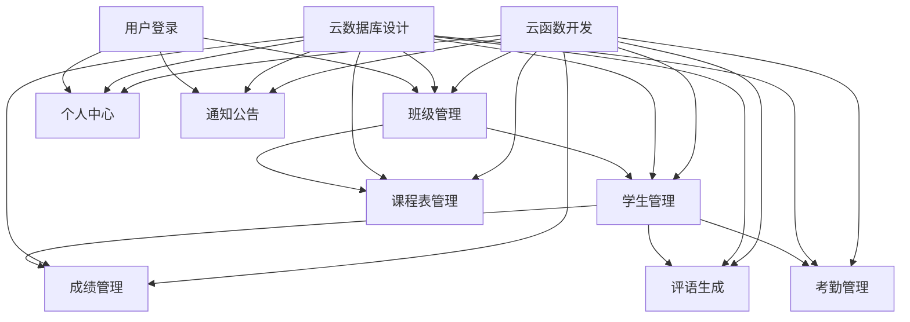

# Teachers Aide - 开发时间线

## 1. 项目概述

Teachers Aide 是一款为中小学教师设计的微信小程序，旨在提供班级管理、成绩管理、评语生成、课程表管理、考勤管理和通知公告等核心功能。本时间线基于敏捷开发方法，分为多个迭代周期，确保项目按时完成。

## 2. 开发团队

| 角色 | 职责 | 人数 |
|------|------|------|
| 产品经理 | 需求分析、功能设计 | 1 |
| 前端开发 | 小程序界面开发 | 2 |
| 后端开发 | 云函数、数据库设计 | 1 |
| UI/UX 设计师 | 界面设计、用户体验 | 1 |
| 测试工程师 | 功能测试、性能测试 | 1 |

## 3. 开发阶段

### 3.1 准备阶段（第1周）

| 任务 | 负责人 | 完成标准 |
|------|--------|----------|
| 需求分析与确认 | 产品经理 | 完成PRD文档 |
| 技术架构设计 | 后端开发 | 确定技术栈和架构 |
| UI设计 | UI/UX设计师 | 完成界面设计规范 |
| 环境搭建 | 前端开发 | 搭建开发环境 |

### 3.2 迭代1：核心功能开发（第2-3周）

| 任务 | 负责人 | 完成标准 | 依赖关系 |
|------|--------|----------|----------|
| 用户登录与授权 | 前端开发 | 实现微信登录功能 | 环境搭建 |
| 班级管理 | 前端开发 | 实现班级创建、编辑、删除 | 用户登录 |
| 学生管理 | 前端开发 | 实现学生添加、编辑、删除 | 班级管理 |
| 云数据库设计 | 后端开发 | 完成数据库表结构设计 | 技术架构设计 |
| 云函数开发 | 后端开发 | 实现基础数据操作 | 数据库设计 |

### 3.3 迭代2：核心功能完善（第4-5周）

| 任务 | 负责人 | 完成标准 | 依赖关系 |
|------|--------|----------|----------|
| 成绩管理 | 前端开发 | 实现考试创建、成绩录入、统计 | 学生管理 |
| 评语生成 | 前端开发 | 实现模板管理、评语生成 | 学生管理 |
| 课程表管理 | 前端开发 | 实现课程添加、编辑、调课 | 班级管理 |
| 数据库优化 | 后端开发 | 实现索引设计、性能优化 | 云数据库设计 |
| 数据同步 | 后端开发 | 实现离线缓存、数据同步 | 云函数开发 |

### 3.4 迭代3：功能扩展（第6-7周）

| 任务 | 负责人 | 完成标准 | 依赖关系 |
|------|--------|----------|----------|
| 考勤管理 | 前端开发 | 实现考勤记录、统计、导出 | 学生管理 |
| 通知公告 | 前端开发 | 实现通知编辑、图片生成 | 基础功能 |
| 个人中心 | 前端开发 | 实现个人信息、数据备份 | 用户登录 |
| 批量导入 | 后端开发 | 实现Excel批量导入功能 | 云函数开发 |
| 数据导出 | 后端开发 | 实现数据导出为Excel/图片 | 云函数开发 |

### 3.5 测试阶段（第8-9周）

| 任务 | 负责人 | 完成标准 | 依赖关系 |
|------|--------|----------|----------|
| 单元测试 | 测试工程师 | 测试单个功能模块 | 所有功能开发 |
| 集成测试 | 测试工程师 | 测试模块间集成 | 单元测试 |
| 系统测试 | 测试工程师 | 测试整体功能 | 集成测试 |
| 性能测试 | 测试工程师 | 测试系统性能 | 系统测试 |
| 兼容性测试 | 测试工程师 | 测试不同设备兼容性 | 系统测试 |

### 3.6 上线准备（第10周）

| 任务 | 负责人 | 完成标准 | 依赖关系 |
|------|--------|----------|----------|
| Bug修复 | 开发团队 | 修复测试发现的问题 | 测试阶段 |
| 灰度发布 | 产品经理 | 小范围用户测试 | Bug修复 |
| 文档完善 | 产品经理 | 完善用户手册、帮助文档 | 灰度发布 |
| 审核准备 | 开发团队 | 准备小程序审核材料 | 灰度发布 |

### 3.7 正式上线（第11周）

| 任务 | 负责人 | 完成标准 | 依赖关系 |
|------|--------|----------|----------|
| 小程序审核 | 开发团队 | 通过微信审核 | 审核准备 |
| 正式发布 | 开发团队 | 全量发布上线 | 小程序审核 |
| 运营推广 | 产品经理 | 开始用户推广 | 正式发布 |
| 数据监控 | 开发团队 | 监控系统运行状态 | 正式发布 |

## 4. 关键里程碑

| 里程碑 | 时间点 | 达成标准 |
|--------|--------|----------|
| 需求确认 | 第1周末 | 完成PRD文档 |
| 核心功能开发完成 | 第5周末 | 完成班级、学生、成绩、评语、课程表功能 |
| 所有功能开发完成 | 第7周末 | 完成考勤、通知、个人中心功能 |
| 测试完成 | 第9周末 | 所有测试用例通过 |
| 灰度发布 | 第10周末 | 小范围用户测试完成 |
| 正式上线 | 第11周末 | 小程序审核通过并发布 |

## 5. 资源分配

### 5.1 人力资源

| 阶段 | 前端开发 | 后端开发 | UI/UX设计 | 产品经理 | 测试工程师 |
|------|----------|----------|-----------|-----------|------------|
| 准备阶段 | 1人 | 1人 | 1人 | 1人 | 0人 |
| 迭代1 | 2人 | 1人 | 0人 | 1人 | 0人 |
| 迭代2 | 2人 | 1人 | 0人 | 1人 | 0人 |
| 迭代3 | 2人 | 1人 | 0人 | 1人 | 0人 |
| 测试阶段 | 1人 | 1人 | 0人 | 1人 | 1人 |
| 上线准备 | 2人 | 1人 | 0人 | 1人 | 1人 |
| 正式上线 | 1人 | 1人 | 0人 | 1人 | 0人 |

### 5.2 时间资源

| 功能模块 | 预计开发时间 | 测试时间 | 总计 |
|----------|--------------|----------|------|
| 用户登录 | 1天 | 0.5天 | 1.5天 |
| 班级管理 | 2天 | 0.5天 | 2.5天 |
| 学生管理 | 3天 | 1天 | 4天 |
| 成绩管理 | 3天 | 1天 | 4天 |
| 评语生成 | 2天 | 0.5天 | 2.5天 |
| 课程表管理 | 2天 | 0.5天 | 2.5天 |
| 考勤管理 | 2天 | 0.5天 | 2.5天 |
| 通知公告 | 2天 | 0.5天 | 2.5天 |
| 个人中心 | 1天 | 0.5天 | 1.5天 |
| 云函数开发 | 5天 | 1天 | 6天 |
| 数据库设计 | 2天 | 0.5天 | 2.5天 |

## 6. 依赖关系

### 6.1 功能依赖

### 6.2 技术依赖

| 技术 | 用途 | 依赖关系 |
|------|------|----------|
| 微信小程序框架 | 前端开发 | 基础依赖 |
| 微信云开发 | 后端服务 | 基础依赖 |
| 云数据库 | 数据存储 | 微信云开发 |
| 云函数 | 服务端逻辑 | 微信云开发 |
| Canvas API | 生成图片 | 微信小程序框架 |
| ExcelJS | Excel处理 | 云函数 |

## 7. 风险与应对措施

| 风险 | 影响 | 应对措施 |
|------|------|----------|
| 需求变更 | 开发延期 | 采用敏捷开发，及时响应变更 |
| 技术难题 | 开发阻塞 | 提前技术调研，寻求解决方案 |
| 资源不足 | 进度缓慢 | 合理分配资源，优先级排序 |
| 测试时间不足 | 质量问题 | 提前规划测试，并行测试 |
| 审核不通过 | 上线延期 | 提前了解审核规则，规范开发 |

## 8. 项目管理

### 8.1 开发工具

- 代码管理：Git
- 项目管理：Trello/Jira
- 沟通工具：企业微信/钉钉
- 文档管理：Confluence

### 8.2 开发流程

1. **需求分析**：产品经理整理需求，生成PRD文档
2. **设计阶段**：UI/UX设计师设计界面，后端开发设计数据库
3. **开发阶段**：前端和后端开发实现功能
4. **测试阶段**：测试工程师进行功能和性能测试
5. **上线阶段**：准备审核材料，发布上线
6. **迭代优化**：根据用户反馈，持续优化功能

### 8.3 质量保证

- 代码评审：每完成一个功能模块进行代码评审
- 单元测试：每个功能模块编写单元测试
- 集成测试：测试模块间集成
- 系统测试：测试整体功能
- 用户测试：灰度发布收集用户反馈

## 9. 验收标准

### 9.1 功能验收

- 所有核心功能实现完成
- 功能符合PRD文档要求
- 用户体验流畅，操作便捷

### 9.2 技术验收

- 代码质量良好，符合编码规范
- 系统性能满足要求
- 数据安全可靠
- 兼容性良好，支持不同设备

### 9.3 文档验收

- PRD文档完整，包含所有需求
- 技术文档齐全，便于维护
- 用户手册清晰，便于使用

## 10. 总结

本开发时间线基于敏捷开发方法，合理规划了Teachers Aide小程序的开发周期和资源分配。通过分阶段迭代，确保核心功能优先实现，同时为后续的优化和扩展预留空间。

在开发过程中，我们将密切关注项目进度，及时调整计划，确保项目按时完成并达到预期的质量标准。同时，我们将注重用户体验，不断优化产品，为教师提供真正实用的教学辅助工具。