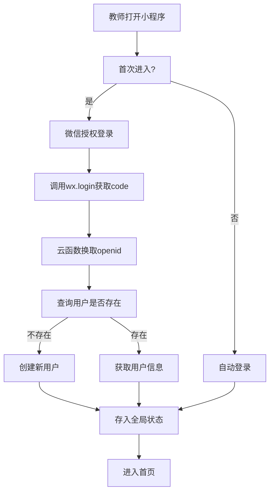
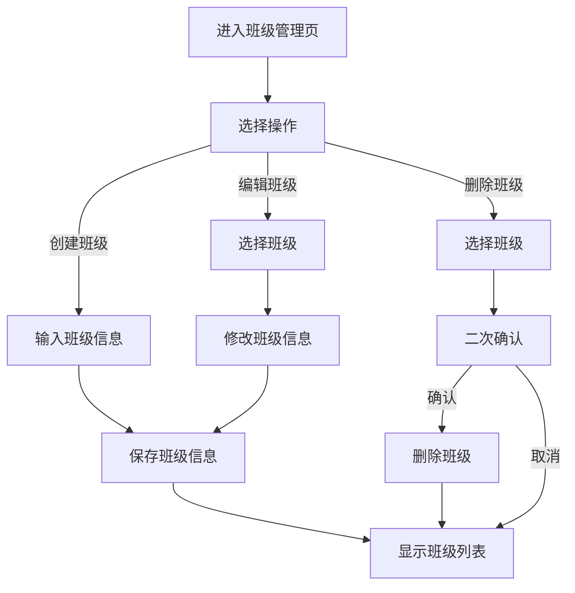
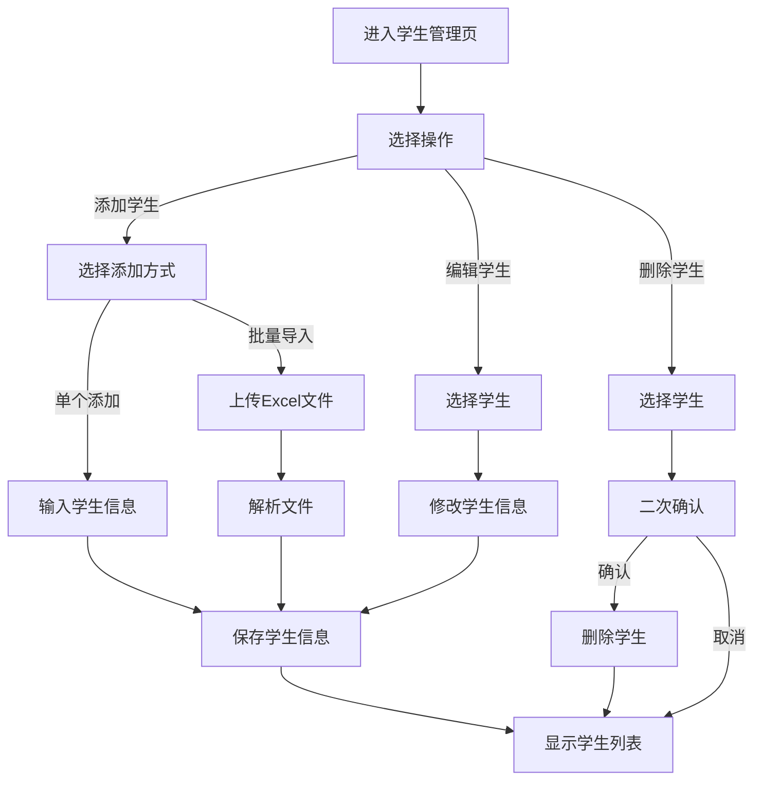
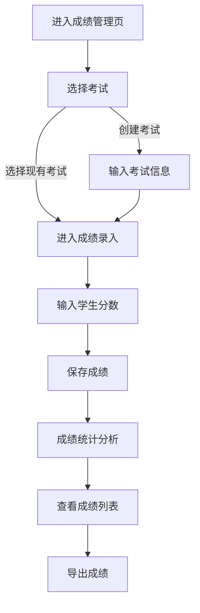
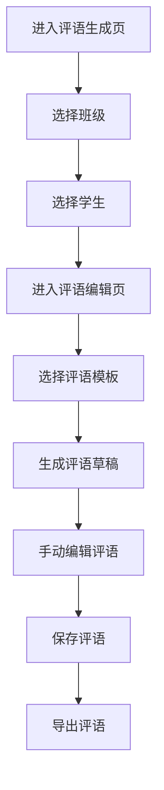
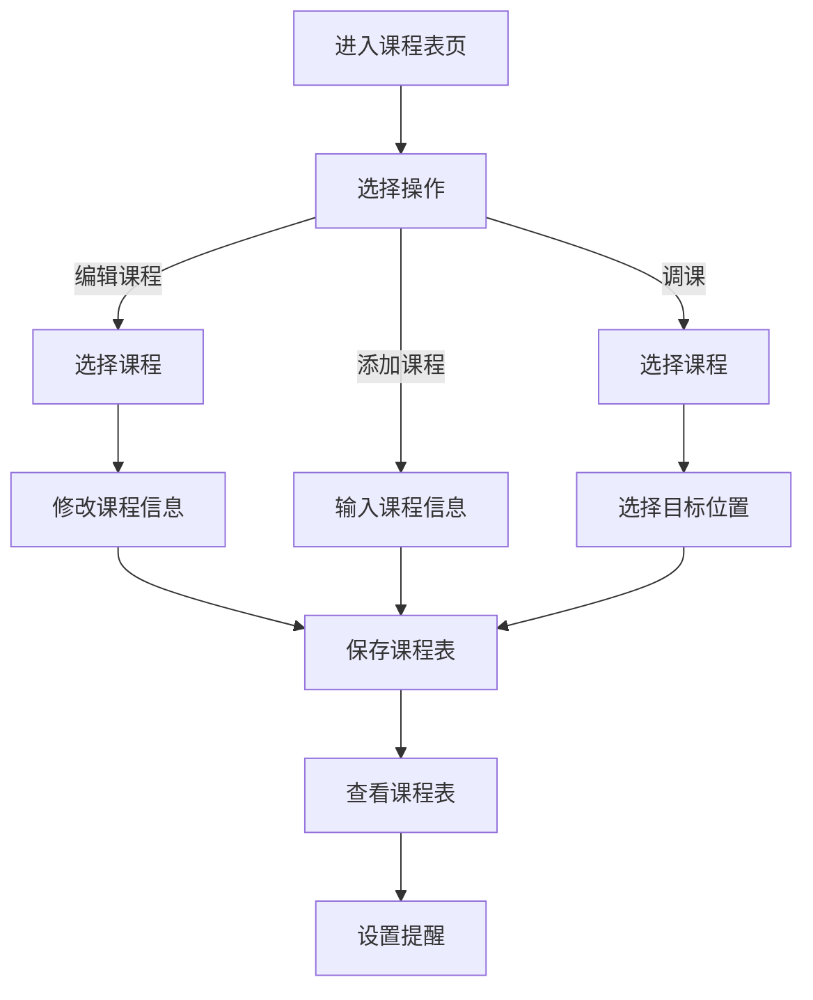
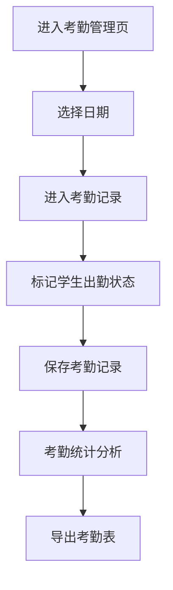
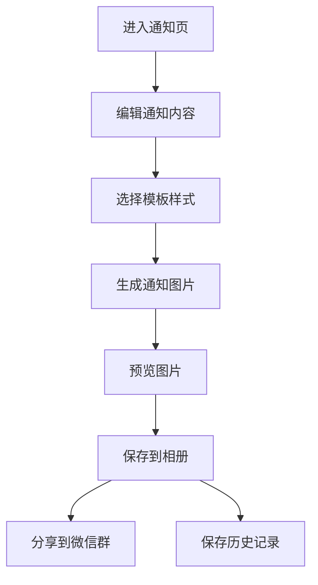
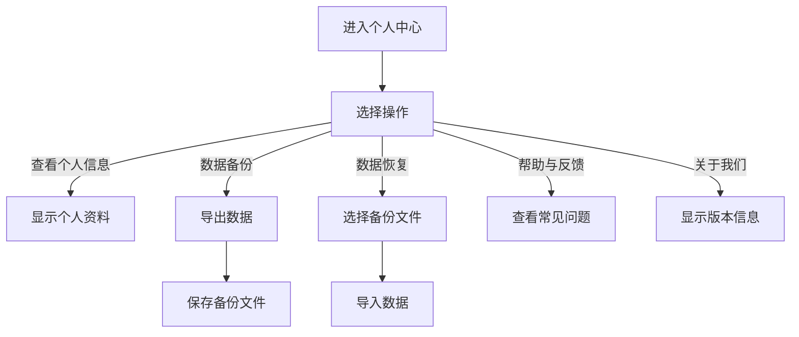

# Teachers Aide - 用户流程图

## 1. 用户登录流程

```mermaid
flowchart TD
    A[教师打开小程序] --> B[首次进入?]
    B -->|是| C[微信授权登录]
    B -->|否| D[自动登录]
    C --> E[调用wx.login获取code]
    E --> F[云函数换取openid]
    F --> G[查询用户是否存在]
    G -->|不存在| H[创建新用户]
    G -->|存在| I[获取用户信息]
    H --> J[存入全局状态]
    I --> J
    D --> J
    J --> K[进入首页]
```

## 2. 班级管理流程

```mermaid
flowchart TD
    A[进入班级管理页] --> B[选择操作]
    B -->|创建班级| C[输入班级信息]
    B -->|编辑班级| D[选择班级]
    B -->|删除班级| E[选择班级]
    C --> F[保存班级信息]
    F --> G[显示班级列表]
    D --> H[修改班级信息]
    H --> F
    E --> I[二次确认]
    I -->|确认| J[删除班级]
    J --> G
    I -->|取消| G
```

## 3. 学生管理流程

```mermaid
flowchart TD
    A[进入学生管理页] --> B[选择操作]
    B -->|添加学生| C[选择添加方式]
    B -->|编辑学生| D[选择学生]
    B -->|删除学生| E[选择学生]
    C -->|单个添加| F[输入学生信息]
    C -->|批量导入| G[上传Excel文件]
    F --> H[保存学生信息]
    G --> I[解析文件]
    I --> H
    H --> J[显示学生列表]
    D --> K[修改学生信息]
    K --> H
    E --> L[二次确认]
    L -->|确认| M[删除学生]
    M --> J
    L -->|取消| J
```

## 4. 成绩录入流程

```mermaid
flowchart TD
    A[进入成绩管理页] --> B[选择考试]
    B -->|创建考试| C[输入考试信息]
    B -->|选择现有考试| D[进入成绩录入]
    C --> D
    D --> E[输入学生分数]
    E --> F[保存成绩]
    F --> G[成绩统计分析]
    G --> H[查看成绩列表]
    H --> I[导出成绩]
```

## 5. 评语生成流程

```mermaid
flowchart TD
    A[进入评语生成页] --> B[选择班级]
    B --> C[选择学生]
    C --> D[进入评语编辑页]
    D --> E[选择评语模板]
    E --> F[生成评语草稿]
    F --> G[手动编辑评语]
    G --> H[保存评语]
    H --> I[导出评语]
```

## 6. 课程表管理流程

```mermaid
flowchart TD
    A[进入课程表页] --> B[选择操作]
    B -->|编辑课程| C[选择课程]
    B -->|添加课程| D[输入课程信息]
    B -->|调课| E[选择课程]
    C --> F[修改课程信息]
    F --> G[保存课程表]
    D --> G
    E --> H[选择目标位置]
    H --> G
    G --> I[查看课程表]
    I --> J[设置提醒]
```

## 7. 考勤管理流程

```mermaid
flowchart TD
    A[进入考勤管理页] --> B[选择日期]
    B --> C[进入考勤记录]
    C --> D[标记学生出勤状态]
    D --> E[保存考勤记录]
    E --> F[考勤统计分析]
    F --> G[导出考勤表]
```

## 8. 通知公告流程

```mermaid
flowchart TD
    A[进入通知页] --> B[编辑通知内容]
    B --> C[选择模板样式]
    C --> D[生成通知图片]
    D --> E[预览图片]
    E --> F[保存到相册]
    F --> G[分享到微信群]
    F --> H[保存历史记录]
```

## 9. 个人中心流程

```mermaid
flowchart TD
    A[进入个人中心] --> B[选择操作]
    B -->|查看个人信息| C[显示个人资料]
    B -->|数据备份| D[导出数据]
    B -->|数据恢复| E[选择备份文件]
    B -->|帮助与反馈| F[查看常见问题]
    B -->|关于我们| G[显示版本信息]
    D --> H[保存备份文件]
    E --> I[导入数据]
```